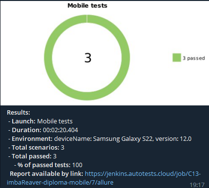

<h2 align="center"> Проект по автоматизации тестирования мобильного приложения <a target="_blank" href="https://github.com/wikimedia/apps-android-wikipedia/releases/tag/latest">Wikipedia</a> </h2>

<a target="_blank" href="https://github.com/wikimedia/apps-android-wikipedia/releases/tag/latest">
<p align="center">
  
</p></a>

## :green_book:	Содержание


> ➠ [Стек технологий](#classical_building-стек-технологий)
>
> ➠ [Реализованные проверки](#earth_africa-реализованные-проверки)
>
> ➠ [Запуск тестов из терминала](#запуск-тестов-из-терминала)
>
> ➠ [Запуск тестов из Jenkins](#запуск-тестов-из-jenkins)
>
> ➠ [Отчет о результатах тестирования в Allure Report](#skier-главная-страница-allure-отчета)
>
> ➠ [Интеграция с Allure TestOps](#интеграция-с-allure-testops)
> 
> ➠ [Уведомления в Telegram с использованием бота](#-уведомления-в-telegram-с-использованием-бота)
>
> ➠ [Пример запуска теста в Selenoid](#-пример-запуска-теста-в-selenoid)


## :classical_building: Стек технологий

<p align="center">


</p>

## :earth_africa: Реализованные проверки

- [x] Проверка текста на 4 экранах онбординга
- [x] Проверка функции поиска
- [x] Проверка открытия статьи

## Запуск тестов из терминала

### :robot: Локальный запуск тестов в эмуляторе с файлом local.properties

```
gradle clean test 
-DdeviceHost=emulation
```
### :robot: Локальный запуск тестов в эмуляторе без файла local.properties

```
gradle clean test 
-DdeviceHost=emulation
-DdeviceName=${DEVICE_NAME}
-DplatformVersion=${PLATFORM_VERSION}
```

### :robot: Локальный запуск тестов на реальном устройстве с файлом local.properties

```
gradle clean test 
-DdeviceHost=real
```
### :robot: Локальный запуск тестов на реальном устройстве без файла local.properties

```
gradle clean test 
-DdeviceHost=real
-DdeviceName=${DEVICE_NAME}
-DplatformVersion=${PLATFORM_VERSION}
```

### :robot: Удаленный запуск тестов с файлом remote.properties

```
gradle clean test
-DdeviceHost=browserstack
```
### :robot: Удаленный запуск тестов без файла remote.properties

```
gradle clean test
-DdeviceHost=browserstack
-Dpassword=${PASSWORD}
-Dapp=${APP}
-Ddevice=${DEVICE}
-DosVersion=${OS_VERSION}
-Dproject=${PROJECT}
-Dname=${NAME}
-Dbuild=${BUILD}
```
## Запуск тестов из Jenkins

<a target="_blank" href="https://jenkins.autotests.cloud/job/C13-imbaReaver-diploma-mobile/">**Сборка в Jenkins**</a>

<p align="center">
  
</p>

## Отчет в Allure Report
### :skier: Главная страница Allure-отчета

<p align="center">

</p>

### :eye_speech_bubble: Тест-кейсы

<p align="center">

</p>


### :frog: Основной дашборд

<p align="center">

</p>

## Интеграция с Allure TestOps
<a target="_blank" href="https://allure.autotests.cloud/launch/16606/tree?treeId=0">**Проект в TestOps**</a>
### :skier: Дашборд Allure TestOps

<p align="center">

</p>

### :eye_speech_bubble: Тест-кейсы

<p align="center">

</p>


##  Уведомления в Telegram с использованием бота

> После завершения сборки специальный бот, созданный в <code>Telegram</code>, автоматически обрабатывает и отправляет сообщение с отчетом о прохождении тестов.

<p align="center">

</p>


##  Пример запуска теста в Browserstack

> К каждому тесту в отчете прилагается видео. Одно из таких видео представлено ниже.
<p align="center">
  
</p>
